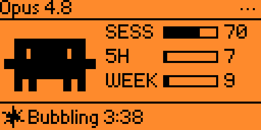

# Flipper Claudeogotchi

A Claude Code **virtual pet** for your Flipper Zero. **Clawd** — Claude Code's
little 8-bit creature — lives on your desk and reacts to what your Claude Code
session is doing right now: he works while you work (spinning spark + the real
Claude spinner verbs + a run timer), shows usage bars, blinks a `!`/`?` when a
turn needs you, and does a happy `> <` when it finishes — with a chime and a
buzz.

> **Unofficial, fan-made project — not affiliated with, endorsed by, or
> sponsored by Anthropic or Bandai.** "Claude" and "Claude Code" are trademarks
> of Anthropic; "Flipper Zero" of Flipper Devices. The names are used
> nominatively only to describe what this tool interoperates with.

It works no matter where Claude Code runs — **local, an SSH box, or a remote dev
container** — because the telemetry comes from inside the Claude Code process
(hooks + statusline), not from the machine you're looking at.



> Header: model + link dot · **SESS** (context fill) / **5H** / **WEEK** usage
> bars · Clawd · working strip: spinner + spinner-verb + `mm:ss` + tokens.

---

## Quick start

> Prereqs: **Node ≥ 22.6** (the relay runs TypeScript via native type-stripping),
> Python 3, and a C compiler. A Flipper Zero for the app; the WiFi board is
> optional (USB path needs no board).

**Easiest: hand it to Claude Code.** After cloning, paste the prompt in
[`docs/setup-prompt.md`](docs/setup-prompt.md) into Claude Code in this repo and
it will set everything up for you (install, build/flash, relay, pair, bridge),
pausing before anything that touches hardware or your config.

Or do it yourself:

```bash
make setup        # one-time: install deps (relay + ufbt)
make flash        # build + upload Clawd to a connected Flipper
```

Then pick how telemetry reaches the Flipper:

### No WiFi board (USB) — simplest

The Flipper stays plugged into this machine; a tiny bridge does the network bit.

```bash
make relay                 # terminal 1: local relay (self-host)
make pair   ID=<CODE>      # wire up Claude Code on this machine
make bridge ID=<CODE>      # stream to the Flipper over USB
```

On the Flipper: **Settings → Link → USB**. `<CODE>` is the 6-char pairing code
shown in the FAP's Settings (auto-generated on first run).

### WiFi board (standalone desk device)

Flash the ESP32-S2 WiFi Dev Board, seat it on the GPIO header, then in the FAP:
**WiFi Setup** → enter SSID/password. Pair the host where Claude Code runs:

```bash
npx github:alexmchughdev/flipper-claudeogotchi --pair <CODE> --relay https://<your-relay>
```

Identical for local, SSH, and dev containers — that's what makes remote work.
Full walkthrough: [docs/setup.md](docs/setup.md).

---

## What Clawd shows

| State | Clawd | Bottom strip |
|-------|-------|--------------|
| **working** | focused, gentle bob | spinning spark + random Claude verb + `mm:ss` + tokens |
| **needs input** | blinking `!` | `input needed` |
| **needs approval** | shakes, blinking `?` | `approval needed` |
| **done** | `> <` happy face (~3s) | `done` + tokens |
| **idle** | blinks, naps | *(hidden)* |

Bars: **SESS** = this conversation's context fill, **5H** / **WEEK** = your
rolling rate-limit usage. Each is null-safe — it holds its last value or shows
`--`, never flickers to zero.

---

## Privacy

Built for sensitive-sector use:

- **`cwd` never leaves the host as more than a basename.** The host-side hook and
  statusline scripts reduce it to the project name *before* sending; the relay
  strips it again as defense in depth.
- **Transcript content never leaves at all** — `transcript_path` is never read.
- **TLS terminates on the ESP32**, never on the Flipper.
- **Self-host the relay** with one `docker compose up`, or `make relay` on a LAN.
- **No AI attribution** in any commit (enforced in repo config + by the installer).

---

## How it works

```
Claude Code (local / SSH / dev container)
  ├─ hooks  (events)   ─┐  HTTPS POST, keyed by pairing code
  └─ statusline (stats)─┤
                        ▼
              Relay (reverse WS tunnel, hosted or self-hosted)
                        │  topic = pairing code
                        ▼
   ESP32-S2 bridge on the GPIO   OR   USB bridge on the host
                        │  compact framed UART  (pins 13/14, or USB CDC)
                        ▼
              Flipper FAP "Claudeogotchi"  (Clawd + bars + vibro/chime)
```

The Flipper has no radio and no TLS stack, so something else does the network +
TLS and hands the Flipper tiny plain UART frames — either the **ESP32-S2 board**
(WiFi) or a **software USB bridge** on the machine the Flipper is plugged into.
The FAP's **Link** setting picks which (USB mode uses a dual CDC so the Flipper
CLI keeps working).

Three update rates collapse into one rendered state: **events** (hooks) drive the
face + haptics, **stats** (statusline) drive the bars, and the relay
**heartbeat** drives the stale/`x` link indicator.

---

## Repository layout

| Path | What |
|------|------|
| [`fap/`](fap/) | Flipper app (C, ufbt): Clawd, bars, working strip, haptics, settings, provisioning. Sprite/screen preview tools included. |
| [`firmware/`](firmware/) | ESP32-S2 bridge (ESP-IDF C): WiFi, WSS/TLS, UART reframe |
| [`relay/`](relay/) | Reverse WS tunnel (TypeScript): ingest, egress, heartbeat, snapshot |
| [`installer/`](installer/) | `npx` installer + host runtime (hooks, statusline, USB bridge) |
| [`proto/`](proto/) | Shared UART framing: C header + TS mirror (byte-identical) |
| [`e2e/`](e2e/) | Mock Claude Code session + bridge proving the acceptance criteria |
| [`docs/`](docs/) | [setup](docs/setup.md) · [protocol](docs/protocol.md) · [troubleshooting](docs/troubleshooting.md) · [decisions](docs/decisions.md) |

## Commands

```bash
make            # list everything
make setup      # install deps
make test       # proto + relay + installer + e2e (all green)
make flash      # build + launch Clawd on a connected Flipper
make relay      # run the relay (self-host)
make pair   ID=<CODE>   # wire up Claude Code here
make bridge ID=<CODE>   # no-board USB stream
make sprite     # re-render the Clawd art / screenshot
```

Hardware-dependent specifics (flashing, real haptics, the ESP32 path) are in
[BUILD_REPORT.md](BUILD_REPORT.md). Everything else is covered by the test suite.

## License

MIT. See [LICENSE](LICENSE).
